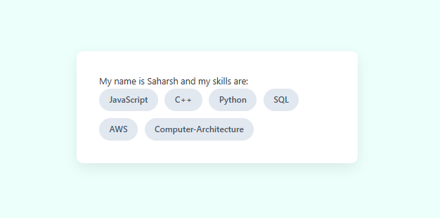

# Custom JavaScript Template Engine

A lightweight, zero-dependency JavaScript template engine built from scratch in **under 50 lines** of pure code. It dynamically parses string templates, evaluates embedded control flow, and compiles them into executable functions at runtime for DOM injection.



## Directory Structure

The logic is strictly separated from the implementation and styling to maintain a modular architecture.

```
javascript-template-engine/
├── app.js         
├── engine.js      
├── index.html     
└── main.css       
```

## Getting Started

No Library and language installation is required as the engine runs natively in the browser.

1. Clone the repository:
```bash
git clone https://github.com/saharshbhatnagar/javascript-template-engine.git
```

2. Navigate to the directory:

```Bash
cd javascript-template-engine
```

 > Open `index.html` in any modern web browser to execute the engine.

## Usage

The engine uses `<% ... %>` syntax to define JavaScript execution from standard text.

```JavaScript
const Template = "My name is <%this.name%> and my skills are: <ul><%for(let index in this.skills) {%> <li><%this.skills[index]%></li> <%}%></ul>";

const myData = {
    name: "Saharsh",
    skills: ["JavaScript", "C++", "Python", "SQL", "AWS", "Computer-Architecture"]
};

const finalHTML = TemplateEngine(Template, myData);

document.getElementById("app-container").innerHTML = finalHTML;
```

## Additional Documentation

**Tech Stack**: JavaScript (ES6), HTML5, CSS3

**Dependencies**: None (Pure Vanilla JS)

### Architecture Notes:

> The TemplateEngine utilizes a single-pass while loop combined with `RegExp.exec()` to parse the string in linear time. Line breaks and carriage returns are stripped during the final compilation phase to prevent Unexpected token ILLEGAL syntax errors during function instantiation.